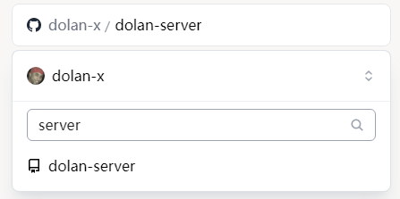
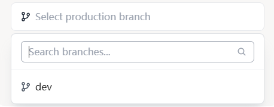
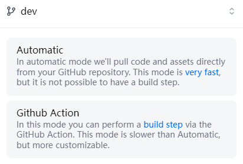
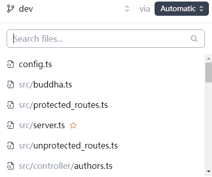

# Dolan Server

## Deploy to Deno deploy

First, fork this repository.

Then, go to [Deno Deploy](https://dash.deno.com/new) and create a new project.

Select the forked repository:

Then, select the branch:

Then, select the deploy method:

Then, select the file:

Click "Add Env Variable".

> TODO